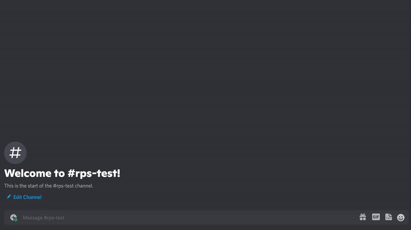

# GovLink Discord Bot

A Discord bot that responds to `/ask` commands with random birthday data displayed in paginated embeds. The bot extracts numbers from user messages and fetches birthday information from a public API.



## 🚀 Features

- **Slash Command**: `/ask` command that accepts natural language input
- **Number Extraction**: Automatically extracts numbers from user messages
- **Paginated Embeds**: Beautiful, paginated display of birthday data
- **Error Handling**: Graceful error handling with styled error messages
- **24/7 Operation**: Deployed on AWS ECS/Fargate for continuous availability

## 📁 Project Structure

```
├── app.js              -> main bot logic (Discord.js)
├── card_embed.js       -> embed builder for birthday cards
├── utils.js           -> utility functions and API helpers
├── commands.js        -> slash command definitions
├── Dockerfile         -> Docker container configuration
├── deploy.sh          -> AWS ECS deployment script
├── ECS_DEPLOYMENT.md  -> detailed deployment guide
├── .dockerignore      -> Docker build exclusions
└── package.json       -> Node.js dependencies
```

## 🛠️ Local Development

### Prerequisites

- [Node.js](https://nodejs.org/) (v18 or higher)
- Discord Bot Token and App ID
- AWS CLI (for deployment)
- Docker (for deployment)

### Setup

1. **Clone and install dependencies:**

```bash
git clone <your-repo>
cd govlink-bot
npm install
```

2. **Configure environment variables:**
   Create a `.env` file:

```env
DISCORD_TOKEN=your_discord_bot_token
APP_ID=your_discord_app_id
PUBLIC_KEY=your_discord_public_key
```

3. **Register slash commands:**

```bash
npm run register
```

4. **Run the bot locally:**

```bash
node app.js
```

## ☁️ AWS Deployment

This bot is designed to run on **AWS ECS with Fargate** for 24/7 availability.

### Quick Deployment

1. **Set environment variables:**

```bash
export DISCORD_TOKEN="your_token"
export APP_ID="your_app_id"
export PUBLIC_KEY="your_public_key"
```

2. **Deploy to AWS:**

```bash
chmod +x deploy.sh
./deploy.sh
```

3. **Complete setup in AWS Console** (see [ECS_DEPLOYMENT.md](ECS_DEPLOYMENT.md) for details)

### Why ECS over Lambda?

- ✅ **Always-on**: No cold starts
- ✅ **WebSocket support**: Proper Discord.js gateway connections
- ✅ **Cost effective**: ~$30/month for 24/7 operation
- ✅ **Better for bots**: Designed for long-running applications

## 🎮 Bot Commands

### `/ask [your message]`

Ask the bot for birthday information. The bot will:

1. Extract numbers from your message
2. Fetch random birthday data for that many entries
3. Display results in beautiful paginated embeds
4. Handle errors gracefully if no number is found

**Examples:**

- `/ask tell me about 5 birthdays`
- `/ask show me 10 random people born today`
- `/ask give me 3 birthday facts`

## 🔧 Discord Permissions

Your bot needs these permissions:

- `Send Messages`
- `Use Slash Commands`
- `Embed Links`
- `Add Reactions` (for pagination)

## 📚 API Integration

The bot fetches birthday data from a public API and formats it into Discord embeds with:

- Person's name and birth year
- Age calculation
- Birthday facts and trivia
- Pagination for multiple results

## 🏗️ Architecture

```
Discord API ←→ Discord.js Gateway ←→ ECS Fargate Task
                                           ↓
                                    CloudWatch Logs
```

## 🔍 Monitoring

- **Logs**: Available in AWS CloudWatch at `/ecs/govlink-bot`
- **Metrics**: ECS service metrics in AWS Console
- **Health**: Bot status visible in Discord server

## 📖 Detailed Documentation

- **[ECS_DEPLOYMENT.md](ECS_DEPLOYMENT.md)** - Complete AWS deployment guide
- **[Discord Developer Portal](https://discord.com/developers/applications)** - Manage your bot settings

## 💡 Troubleshooting

### Bot not responding:

1. Check ECS service is running in AWS Console
2. Verify bot token and permissions
3. Check CloudWatch logs for errors

### Deployment issues:

1. Ensure AWS CLI is configured
2. Check IAM permissions for ECS/ECR
3. Verify Docker is running
4. See [ECS_DEPLOYMENT.md](ECS_DEPLOYMENT.md) for detailed troubleshooting

## 🤝 Contributing

1. Fork the repository
2. Create a feature branch
3. Make your changes
4. Test locally
5. Submit a pull request

## 📄 License

This project is licensed under the MIT License - see the [LICENSE](LICENSE) file for details.

---

**Need help?** Check out the [Discord Developer Documentation](https://discord.com/developers/docs/intro) or join the [Discord Developers server](https://discord.gg/discord-developers).
